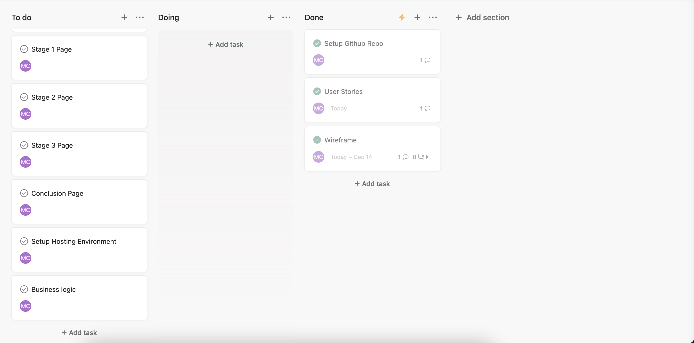
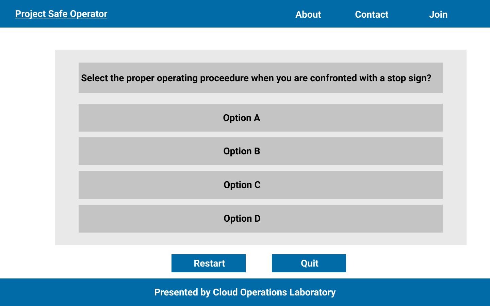
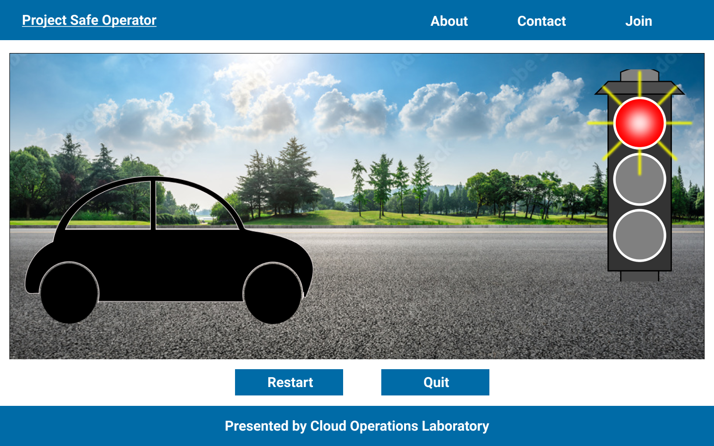
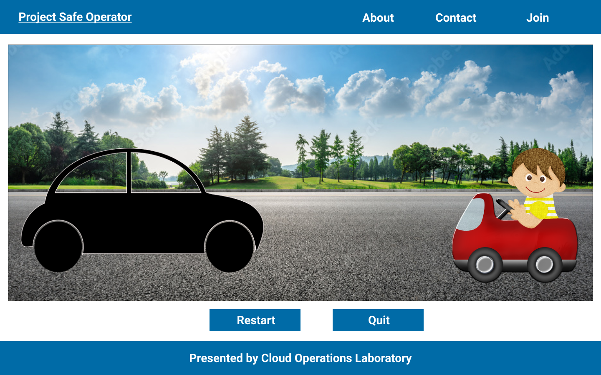

# Project Scaling Barnacle

_Scaling Barnacle is the GitHub suggested name for the repository._

This is my first project while attending the Software Engineering Immersive course at General Assembly. This project is an attempt to demonstrate my understanding of the concepts covered in unit one.

### Unit 1 Topics
* HTML
* CSS
* JavaScript
  * Document Object Model
  * jQuery
  * Ajax
* Git

### Objective
Leveraging all the topics covered in unit one, produce an interactive game. _Use of jQuery is optional._

### Mockups

###### User Stories

###### Stage 1 / Warmup Questions
_Release Date: 18Dec2021_

###### Stage 2 / Sign Recognition
_Release Date: TBA_

###### Stage 3 / Overcoming Obstacles
_Release Date: TBA_

### Attributions

👉 Mockups created with Figma https://www.figma.com

👉 Project tasks tracked with Asana https://asana.com/

👉 Background image of highway scenery from https://www.pinclipart.com/

👉 Black car silhouette from https://www.pinclipart.com/

👉 Traffic light from https://www.pinclipart.com/

👉 Baby in red car from https://www.pinclipart.com/